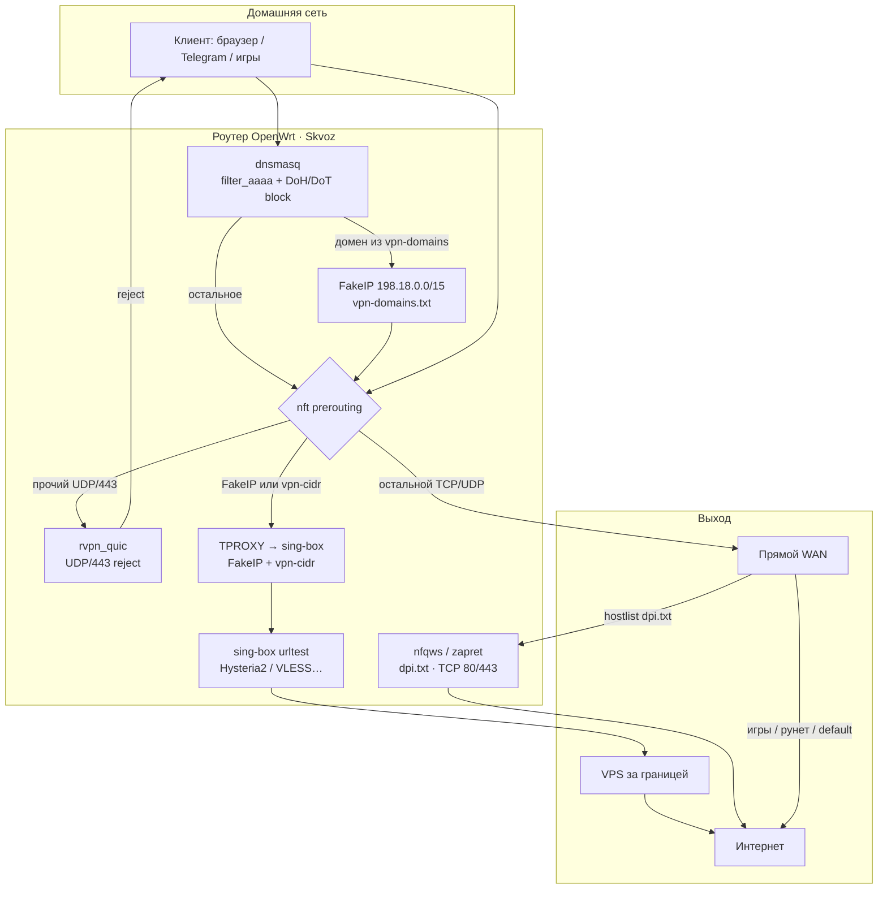

# Skvoz

Гибридный обход блокировок для OpenWrt: **zapret** (DPI / nfqws) + узкий **VPN** (sing-box, FakeIP + CIDR). Рунет, игры и остальной трафик идут напрямую.

Репозиторий: https://github.com/spamulodd/skvoz

## Как это работает



Три слоя:

| Слой | Когда | Примеры |
|------|--------|---------|
| **DIRECT** | geoip / private / игры / всё остальное | Steam, банки РФ, обычные сайты |
| **zapret** | DPI на реальных IP, hostlist | hdrezka, rutracker |
| **VPN** | FakeIP по домену **или** TPROXY по IP | YouTube, Telegram (+ DC/media CIDR), Meta, Discord, TikTok, X, AI, новости |

Telegram ходит на DC **по IP** (не только по DNS). Поэтому медиа (фото/видео/стикеры) требует актуального `vpn-cidr.txt`. Официальный список: https://core.telegram.org/resources/cidr.txt — обновление: `sh tools/sync-telegram-cidr.sh`.

Подробная матрица: [`openwrt/usr/share/rvpn/rules/ROUTING.md`](openwrt/usr/share/rvpn/rules/ROUTING.md).

## Защиты DNS

При включённом zapret или VPN:

- **filter_aaaa** — клиенты не уходят в IPv6 в обход правил
- **блок DoH/DoT** (`doh-cidr.txt`) — браузер использует DNS роутера
- **QUIC reject** (UDP/443) — кроме FakeIP и `vpn_cidr` (иначе ломаются YouTube API и Telegram media)

## Требования

- OpenWrt 24+/25.x (apk или opkg)
- `sing-box` (VPN-слой)
- `nfqws` под вашу CPU → `/opt/rvpn/nfqws` (в пакет не входит)
- `libnetfilter-queue`, `kmod-nft-queue`, `kmod-nft-tproxy`

## Установка

Скрипты и списки **не зависят от архитектуры**; `nfqws` кладётся отдельно.

### `tools/install.sh`

```sh
git clone https://github.com/spamulodd/skvoz.git && cd skvoz
sh tools/install.sh
```

Через tarball: `SKVOZ_TARBALL=/tmp/skvoz-*.tar.gz sh tools/install.sh`

### `.ipk` без SDK — `tools/mkipk.sh`

```sh
sh tools/mkipk.sh                    # → dist/skvoz_*_all.ipk
opkg install /tmp/skvoz_*_all.ipk
```

### Пакет из OpenWrt SDK — `package/skvoz/Makefile`

```sh
# скопируйте package/skvoz и openwrt/ в дерево SDK
make package/skvoz/compile V=s
apk add --allow-untrusted bin/packages/*/base/skvoz_*.apk   # OpenWrt 25+
```

## После установки

1. Отредактируйте `/etc/config/rvpn`: `YOUR_VPS_IP`, `YOUR_HY2_PASSWORD` (и при необходимости `ui_secret`).
2. Положите `nfqws` в `/opt/rvpn/nfqws` (`chmod +x`).
3. UI: `http://LAN_IP:81/` (только LAN, `rfc1918_filter=1`) — пароль: `uci get rvpn.main.ui_secret`.
4. Слои **выключены** в дефолтном конфиге (upgrade **не** сбрасывает включённые слои):

```sh
rvpnctl enable-zapret    # после nfqws
rvpnctl enable-vpn       # после настройки ноды и sing-box
```

## Списки маршрутизации (git)

| Файл | Назначение |
|------|------------|
| `vpn-domains.txt` | FakeIP → VPN |
| `vpn-cidr.txt` | IP → VPN (Telegram DC/media, Meta) |
| `dpi.txt` | zapret hostlist |
| `games-domains.txt` | DIRECT |
| `doh-cidr.txt` | блок публичных DoH |

```sh
sh tools/sync-telegram-cidr.sh   # обновить Telegram CIDR из official
```

## `rvpnctl`

| Команда | Действие |
|---------|----------|
| `rvpnctl status` | Слои, процессы, nft |
| `rvpnctl start` / `stop` / `restart` | Сервис |
| `rvpnctl enable-zapret` / `disable-zapret` | zapret |
| `rvpnctl enable-vpn` / `disable-vpn` | VPN |
| `rvpnctl gen-config` | Пересобрать sing-box.json |
| `rvpnctl log [N]` | Лог (по умолчанию 80 строк) |

## Fail-open

При падении sing-box watchdog снимает FakeIP-hijack DNS, чтобы не оставить клиентов без интернета. Остановка: nft flush **до** kill процессов.

## Roadmap

Идеи для других пользователей и долги code review: **[ROADMAP.md](ROADMAP.md)**.

## Лицензия

MIT — см. [LICENSE](LICENSE).
