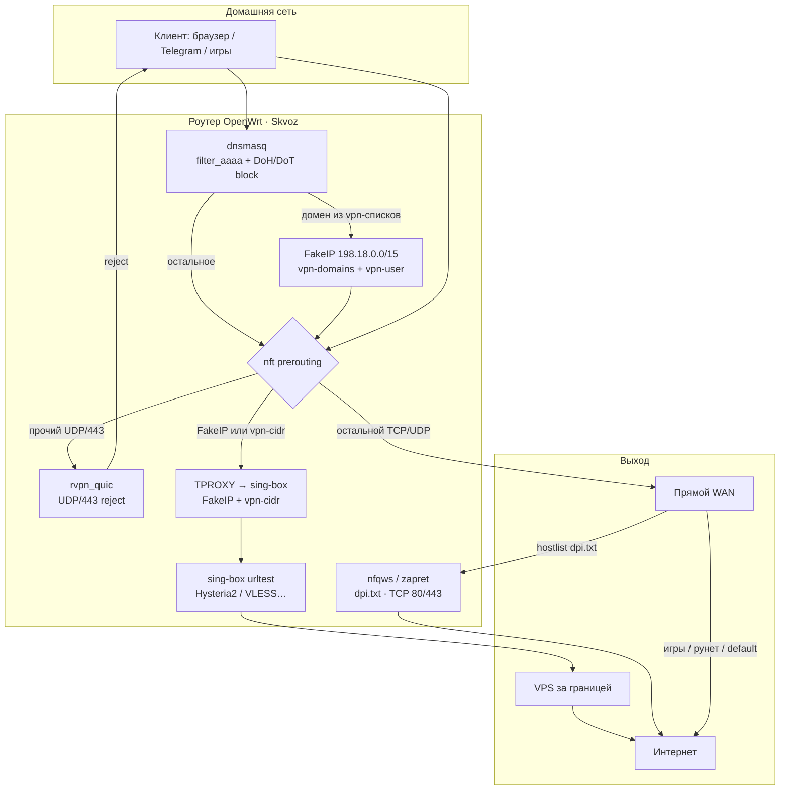

# Skvoz

Гибридный обход блокировок для OpenWrt: **zapret** (DPI / nfqws) + узкий **VPN** (sing-box, FakeIP + CIDR). Рунет, игры и остальной трафик идут напрямую.

Репозиторий: https://github.com/spamulodd/skvoz

## Как это работает



| Слой | Когда | Примеры |
|------|--------|---------|
| **DIRECT** | private / игры / всё остальное | Steam, банки РФ, обычные сайты |
| **zapret** | DPI на реальных IP | hdrezka, rutracker |
| **VPN** | FakeIP по домену или TPROXY по IP | YouTube, Telegram, Meta, Discord, TikTok, LIB/atsu, AI, новости |

Подробная матрица: [`openwrt/usr/share/rvpn/rules/ROUTING.md`](openwrt/usr/share/rvpn/rules/ROUTING.md).

## Требования

- OpenWrt 24+/25.x (apk или opkg)
- `sing-box` (VPN-слой)
- `nfqws` под вашу CPU → `/opt/rvpn/nfqws` (в пакет не входит)
- `libnetfilter-queue`, `kmod-nft-queue`, `kmod-nft-tproxy`

## Установка

```sh
git clone https://github.com/spamulodd/skvoz.git && cd skvoz
sh tools/install.sh
```

Через tarball: `SKVOZ_TARBALL=/tmp/skvoz-*.tar.gz sh tools/install.sh`

`.ipk`: `sh tools/mkipk.sh` → `opkg install …`  
SDK: см. `package/skvoz/Makefile`.

## Настройка VPN

Нужен VPS за границей с **Hysteria2** или **VLESS+Reality**. Слои по умолчанию выключены — сначала нода, потом `enable-vpn`.

### 1. Нода Hysteria2 (типичный вариант)

SSH на роутер:

```sh
uci set rvpn.vps_hy2.server='IP_ВАШЕГО_VPS'
uci set rvpn.vps_hy2.port='433'
uci set rvpn.vps_hy2.password='ПАРОЛЬ_HY2'
uci set rvpn.vps_hy2.sni='bing.com'
uci set rvpn.vps_hy2.insecure='0'    # 1 только если самоподписанный TLS
uci set rvpn.vps_hy2.enabled='1'
uci commit rvpn
```

Или правьте `/etc/config/rvpn` вручную — секция `config node 'vps_hy2'`.

### 2. Нода VLESS + Reality (добавить секцию)

```sh
uci set rvpn.vps_vless=node
uci set rvpn.vps_vless.enabled='1'
uci set rvpn.vps_vless.tag='vps-vless'
uci set rvpn.vps_vless.type='vless'
uci set rvpn.vps_vless.server='IP_VPS'
uci set rvpn.vps_vless.port='443'
uci set rvpn.vps_vless.uuid='UUID'
uci set rvpn.vps_vless.sni='www.cloudflare.com'
uci set rvpn.vps_vless.reality_public_key='PUBLIC_KEY'
uci set rvpn.vps_vless.reality_short_id='SHORT_ID'
uci commit rvpn
```

Несколько включённых нод → sing-box **urltest** выбирает быстрейшую.

### 3. Проверка конфига и включение

```sh
rvpnctl gen-config          # должен сказать OK
rvpnctl enable-vpn          # поднимет sing-box + FakeIP + nft
rvpnctl status              # vpn_running=1, wan_ok=1
```

Проверка с роутера:

```sh
nslookup www.youtube.com 127.0.0.1          # → 198.18.x.x
curl -x socks5h://127.0.0.1:10808 -I https://www.youtube.com/
```

### 4. UI

```text
http://192.168.1.1:81/
```

Токен (скопировать целиком):

```sh
rvpnctl ui-secret
# или: uci get rvpn.main.ui_secret
```

В UI: тумблер VPN, ping узла, быстрое добавление домена в VPN.

### 5. Свои домены в VPN

```sh
rvpnctl add-domain example.com
rvpnctl del-domain example.com
rvpnctl list-domains
```

Список пользователя: `/usr/share/rvpn/rules/vpn-user.txt` (не затирается обновлением shipped-списков).

### 6. Zapret (опционально, параллельно с VPN)

```sh
# бинарник под CPU роутера:
cp nfqws /opt/rvpn/nfqws && chmod +x /opt/rvpn/nfqws
rvpnctl enable-zapret
```

## Списки маршрутизации

| Файл | Назначение |
|------|------------|
| `vpn-domains.txt` | FakeIP → VPN (базовый набор) |
| `vpn-user.txt` | FakeIP → VPN (ваши домены) |
| `vpn-cidr.txt` | IP → VPN (Telegram DC/media, Meta) |
| `dpi.txt` | zapret hostlist |
| `games-domains.txt` | DIRECT |
| `doh-cidr.txt` | блок публичных DoH |

```sh
sh tools/sync-telegram-cidr.sh   # обновить Telegram CIDR
```

## `rvpnctl`

| Команда | Действие |
|---------|----------|
| `status` | Слои, процессы, nft |
| `start` / `stop` / `restart` | Сервис |
| `enable-vpn` / `disable-vpn` | VPN |
| `enable-zapret` / `disable-zapret` | zapret |
| `gen-config` | Пересобрать sing-box.json |
| `add-domain` / `del-domain` / `list-domains` | Быстрый VPN-домен |
| `ui-secret` | Показать токен UI |
| `log [N]` | Лог |

## Защиты DNS и fail-open

При включённом zapret или VPN: `filter_aaaa`, блок DoH/DoT, redirect DNS LAN→роутер, QUIC reject (кроме FakeIP/`vpn_cidr`).

Если sing-box падает — watchdog убирает FakeIP, интернет остаётся. Stop: nft flush **до** kill процессов.

## Лицензия

MIT — см. [LICENSE](LICENSE).
